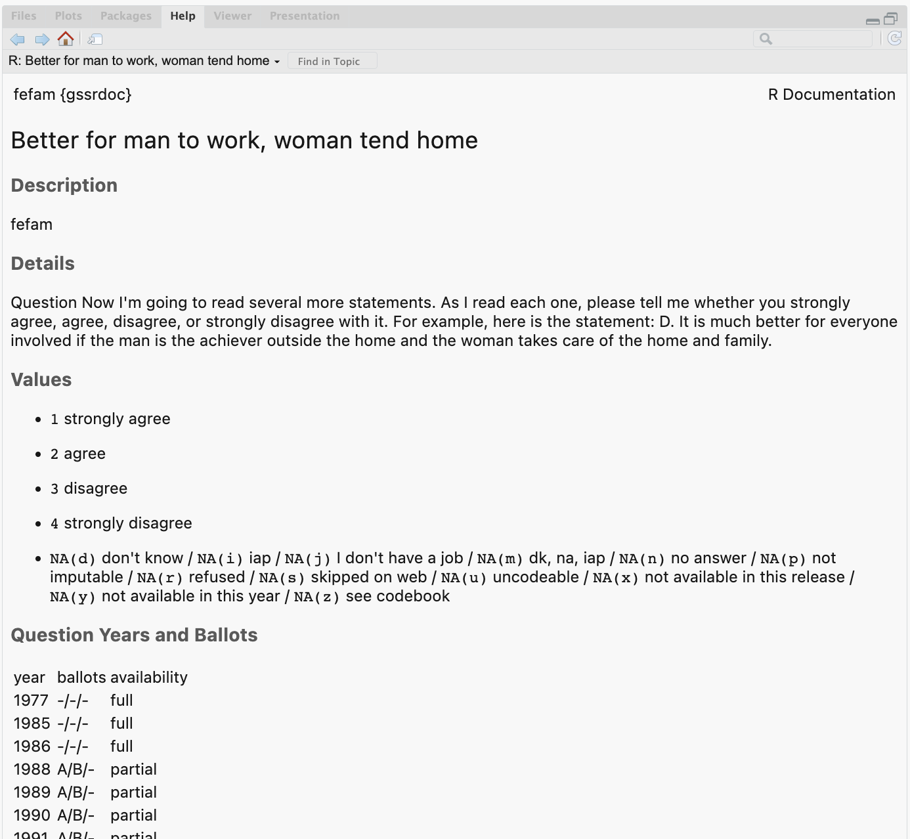
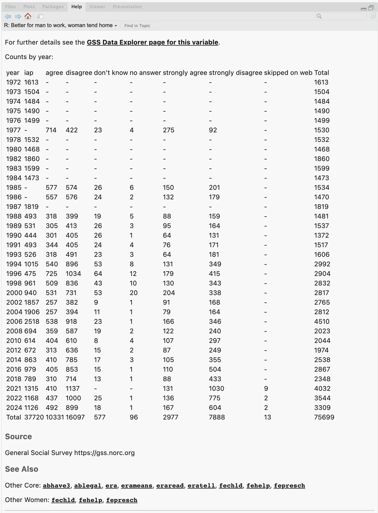

<!-- README.md is generated from README.Rmd. Please edit that file -->

```{r, include = FALSE}
knitr::opts_chunk$set(
  collapse = TRUE,
  comment = "#>",
  fig.path = "man/figures/README-",
  out.width = "100%"
)
```

# gssrdoc 

<!-- badges: start -->
[](https://github.com/kjhealy/gssrdoc/actions/workflows/R-CMD-check.yaml)
[](https://kjhealy.r-universe.dev/gssrdoc)
<!-- badges: end -->

Documentation for the General Social Survey Cumulative Data (1972-2024) packaged for easy use in R. This package is a companion to the [`gssr`](https://github.com/kjhealy.gssr) package. I recommend you install both of them.

## Installation

The relatively large number of variables documented in `{gssrdoc}` means it is not suitable for hosting on [CRAN](https://cran.r-project.org/), the core R package repository. The same is true of the `{gssr}` package.

### Install via R-Universe

My [R Universe](https://kjhealy.r-universe.dev/) provides binary packages for `{gssrdoc}` and `{gssr}`. To install both packages, copy and paste the following code to the R console:

``` r
# Install 'gssrdoc' from 'ropensci' universe
install.packages('gssrdoc', repos =
  c('https://kjhealy.r-universe.dev', 'https://cloud.r-project.org'))

# Also recommended: install 'gssr' as well
install.packages('gssr', repos =
  c('https://kjhealy.r-universe.dev', 'https://cloud.r-project.org'))
```

Because the packages have dependencies that are on CRAN, we add CRAN as well as the R Universe to the `repos` argument.

The binary packages will install noticeably quicker than building the package from source. Plus, you can use `install.packages()` directly.

## Install direct from GitHub

You can also install gssrdoc from [GitHub](https://github.com/kjhealy/gssrdoc) with:

``` r
remotes::install_github("kjhealy/gssrdoc")
```

## Integrated Help

`{gssrdoc}` provides documentation for all GSS variables in the cumulative data file via R's help system. You can browse variables by name in the package's help file or type `?` followed by the name of the variable at the console to get a standard R help page containing information on the variable, the values it takes, the years and ballots it is available for, and (in most cases) a crosstabulation of the variable's values for each year of the GSS. This facility is particularly convenient in an IDE such as RStudio or Microsoft Visual Studio. The help page for each variable links to the [GSS Data Explorer](https://gssdataexplorer.norc.org) page for that variable. The "See Also" section at the bottom of the help page incorporates the GSS's own cross-referencing by module and topic. 





Information about the variables is also contained in the `gss_dict` object:

``` r 
library(tibble)
library(gssrdoc)
gss_dict
```


## Official GSS Documentation

The [GSS Documentation Page](https://gss.norc.org/us/en/gss/get-documentation.html) contains links to extensive technical documentation for the survey, including [Release Notes for the 1972-2024 Cumulative File](https://gss.norc.org/content/dam/gss/get-documentation/pdf/other/Release%20Notes%207224.pdf) and [What's New in 2024](https://gss.norc.org/content/dam/gss/get-documentation/pdf/other/GSS%202024%20-%20Whats%20New.pdf).


## Further details

The package is documented at <http://kjhealy.github.io/gssrdoc/>. The GSS homepage is at <http://gss.norc.org/>. While `{gssrdoc}` package incorporates the publicly-available GSS cumulative data file, this package is not associated with or endorsed by the National Opinion Research Center or the General Social Survey.
