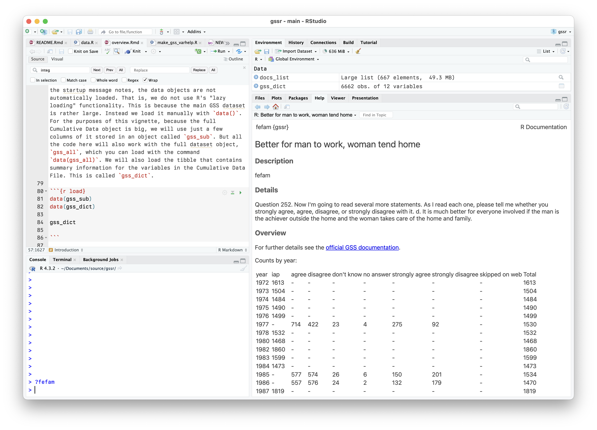

<!-- README.md is generated from README.Rmd. Please edit that file -->

# gssrdoc 

<!-- badges: start -->
<!-- badges: end -->

Documentation for the General Social Survey Cumulative Data (1972-2022,
release 2a) packaged for easy use in R. This package is a companion to
the [`gssr`](https://github.com/kjhealy.gssr) package.

## Install direct from GitHub

You can install gssrdoc from
[GitHub](https://github.com/kjhealy/gssrdoc) with:

``` r
remotes::install_github("kjhealy/gssrdoc")
```

## Integrated Help

`{gssrdoc}` provides documentation for all GSS variables in the
cumulative data file via R’s help system. You can browse variables by
name in the package’s help file or type `?` followed by the name of the
variable at the console to get a standard R help page containing
information on the variable, the values it takes and (in most cases) a
crosstabulation of the variable’s values for each year of the GSS. This
facility is particularly convenient in an IDE such as RStudio or
Microsoft Visual Studio.



Information about the variables is also contained in the `gss_dict`
object:

``` r
library(tibble)
library(gssrdoc)
gss_dict
#> # A tibble: 6,663 × 13
#>      pos variable label     missing var_doc_label value_labels var_text years   
#>    <int> <chr>    <chr>       <int> <chr>         <chr>        <chr>    <list>  
#>  1     1 year     gss year…       0 gss year for… [NA(d)] don… None     <NULL>  
#>  2     2 wrkstat  labor fo…      36 labor force … [1] working… 1. Last… <tibble>
#>  3     3 hrs1     number o…   30830 number of ho… [89] 89+ ho… 1a. If … <tibble>
#>  4     4 hrs2     number o…   70989 number of ho… [89] 89+ ho… 1b. If … <tibble>
#>  5     5 evwork   ever wor…   46944 ever work as… [1] yes; [2… 1c. If … <tibble>
#>  6     6 occ      r's cens…   48123 r's census o… [NA(d)] don… 2a. Wha… <tibble>
#>  7     7 prestige r's occu…   48123 r's occupati… [NA(d)] don… 2a. Wha… <tibble>
#>  8     8 wrkslf   r self-e…    4041 r self-emp o… [1] self-em… 2e. (Ar… <tibble>
#>  9     9 wrkgovt  govt or …   44311 govt or priv… [1] governm… 2f. (Ar… <tibble>
#> 10    10 commute  travel t…   71060 travel time … [97] 97+ mi… 2g. Abo… <tibble>
#> # ℹ 6,653 more rows
#> # ℹ 5 more variables: var_yrtab <list>, var_ballots <list>, col_type <chr>,
#> #   var_type <chr>, var_na_codes <chr>
```

## The GSS and COVID-19

The GSS administrators have released a [Methodological
Primer](https://gss.norc.org/Documents/other/2021%20XSEC%20R1%20Methodological%20Primer.pdf)
along with the [Documentation and Codebook for the 2021
survey](https://gss.norc.org/Documents/codebook/GSS%202021%20Codebook%20R1.pdf)
that users should read carefully in connection with the effects of
COVID-19 on data collection for the GSS.

The Primer notes:

> Since its inception, the GSS has conducted data collection via
> in-person interviews as its primary mode of data collection. The
> pandemic forced the GSS to change this design, moving from in-person
> to address- based sampling and a push-to-web methodology, with the
> bulk of the interview conducted online via a self- administered
> questionnaire.

In addition,

> We recommend our users include the one of the following statements
> when reporting on the GSS 2021 Cross-section data: *Total Survey Error
> Summary Perspective for the 2021 GSS Cross-section:* Changes in
> opinions, attitudes, and behaviors observed in 2021 relative to
> historical trends may be due to actual change in concept over time
> and/or may have resulted from methodological changes made to the
> survey methodology during the COVID-19 global pandemic.

And,

> *Suggested Statement to Include in Articles and Reports That Use GSS
> Data:* To safeguard the health of staff and respondents during the
> COVID-19 pandemic, the 2021 GSS data collection used a mail-to-web
> methodology instead of its traditional in-person interviews. Research
> and interpretation done using the data should take extra care to
> ensure the analysis reflects actual changes in public opinion and is
> not unduly influenced by the change in data collection methods. For
> more information on the 2021 GSS methodology and its implications,
> please visit https://gss.norc.org/Get-The-Data

## Further details

The package is documented at <http://kjhealy.github.io/gssrdoc/>. The
GSS homepage is at <http://gss.norc.org/>. While `{gssrdoc}` package
incorporates the publicly-available GSS cumulative data file, this
package is not associated with or endorsed by the National Opinion
Research Center or the General Social Survey.
