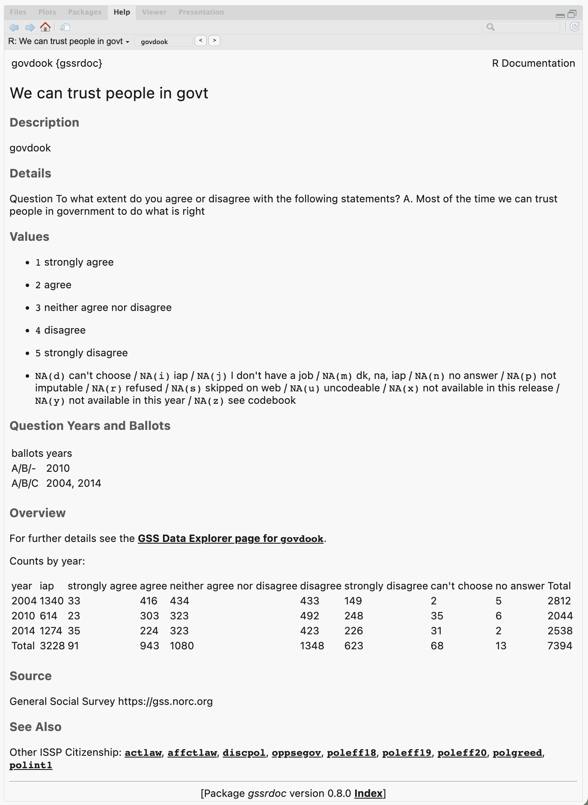

<!-- README.md is generated from README.Rmd. Please edit that file -->

# gssrdoc 

<!-- badges: start -->

[](https://github.com/kjhealy/gssrdoc/actions/workflows/R-CMD-check.yaml)
[](https://kjhealy.r-universe.dev/gssrdoc)
<!-- badges: end -->

Documentation for the General Social Survey Cumulative Data (1972-2024)
packaged for easy use in R. This package is a companion to the
[`gssr`](https://kjhealy.github.io/gssr) package. I recommend you
install both of them.

## Installation

The relatively large number of variables documented in `{gssrdoc}` means
it is not suitable for hosting on [CRAN](https://cran.r-project.org/),
the core R package repository. The same is true of the
[`gssr`](https://kjhealy.github.io/gssr) package.

### Install via R-Universe

My [R Universe](https://kjhealy.r-universe.dev/) provides binary
packages for `{gssrdoc}` and [`gssr`](https://kjhealy.github.io/gssr).
To install both packages, copy and paste the following code to the R
console:

``` r
# Install 'gssrdoc' from 'ropensci' universe
install.packages('gssrdoc', repos =
  c('https://kjhealy.r-universe.dev', 'https://cloud.r-project.org'))

# Also recommended: install 'gssr' as well
install.packages('gssr', repos =
  c('https://kjhealy.r-universe.dev', 'https://cloud.r-project.org'))
```

Because the packages have dependencies that are on CRAN, we add CRAN as
well as the R Universe to the `repos` argument. These binary packages
will install much faster than building the package from source. Plus,
you can use `install.packages()` directly.

## Install direct from GitHub

You can also install gssrdoc from
[GitHub](https://github.com/kjhealy/gssrdoc) with:

``` r
remotes::install_github("kjhealy/gssrdoc")
```

## Integrated Help

`{gssrdoc}` provides documentation for all GSS variables in the
cumulative data file via R’s help system. You can browse variables by
name in the package’s help file or type `?` followed by the name of the
variable at the console to get a standard R help page containing
information on the variable, the values it takes, and the years and
ballots it is available for. This makes it much easier to check GSS
documentation while using R in an IDE such as RStudio, VSCode, or
Positron. The help page for each variable links to the [GSS Data
Explorer](https://gssdataexplorer.norc.org) page for that variable. The
“See Also” section at the bottom of the help page incorporates the GSS’s
own cross-referencing by module. The [documentation website for the
packge](https://kjhealy.github.io/gssrdoc) has a full listing of the
variables and a topical index organized by survey module and the GSS’s
own subject tags.



Information about the variables is also contained in the `gss_doc`
object:

``` r
library(tibble)
library(gssrdoc)

gss_doc
#> # A tibble: 6,694 × 12
#>    variable description                           question                   norc_id norc_url var_yrtab yrballot_df module_df subject_df value_labels var_type var_na_codes
#>    <chr>    <chr>                                 <chr>                        <int> <chr>    <list>    <list>      <list>    <list>     <chr>        <chr>    <chr>       
#>  1 year     GSS year for this respondent          "GSS year"                       1 https:/… <chr [1]> <tibble>    <tibble>  <tibble>   "[NA(d)] do… numeric  .d,.i,.j,.m…
#>  2 id       Respondent id number                  "Respondent id number"           2 https:/… <chr [1]> <tibble>    <tibble>  <tibble>   ""           <NA>     <NA>        
#>  3 wrkstat  labor force status                    "Last week were you worki…       3 https:/… <tibble>  <tibble>    <tibble>  <tibble>   "[1] workin… numeric  .d,.i,.j,.m…
#>  4 hrs1     number of hours worked last week      "Last week were you worki…       4 https:/… <chr [1]> <tibble>    <tibble>  <tibble>   "[89] 89+ h… numeric  .d,.i,.j,.m…
#>  5 hrs2     number of hours usually work a week   "Last week were you worki…       5 https:/… <tibble>  <tibble>    <tibble>  <tibble>   "[89] 89+ h… numeric  .d,.i,.j,.m…
#>  6 evwork   ever work as long as one year         "Last week were you worki…       6 https:/… <tibble>  <tibble>    <tibble>  <tibble>   "[1] yes / … numeric  .d,.i,.j,.m…
#>  7 occ      R's census occupation code (1970)     "A. What kind of work do …       7 https:/… <chr [1]> <tibble>    <tibble>  <tibble>   "[NA(d)] do… numeric  .d,.i,.j,.m…
#>  8 prestige r's occupational prestige score(1970) "A. What kind of work do …       8 https:/… <tibble>  <tibble>    <tibble>  <tibble>   "[NA(d)] do… numeric  .d,.i,.j,.m…
#>  9 wrkslf   r self-emp or works for somebody      "A. What kind of work do …       9 https:/… <tibble>  <tibble>    <tibble>  <tibble>   "[1] self-e… numeric  .d,.i,.j,.m…
#> 10 wrkgovt  govt or private employee              "A. What kind of work do …      10 https:/… <tibble>  <tibble>    <tibble>  <tibble>   "[1] govern… numeric  .d,.i,.j,.m…
#> # ℹ 6,684 more rows
```

## Official GSS Documentation

The [GSS Documentation
Page](https://gss.norc.org/us/en/gss/get-documentation.html) contains
links to extensive technical documentation for the survey, including
[Release Notes for the 1972-2024 Cumulative
File](https://gss.norc.org/content/dam/gss/get-documentation/pdf/other/Release%20Notes%207224.pdf)
and [What’s New in
2024](https://gss.norc.org/content/dam/gss/get-documentation/pdf/other/GSS%202024%20-%20Whats%20New.pdf).

## Further details

The package is documented at <http://kjhealy.github.io/gssrdoc/>. The
GSS homepage is at <http://gss.norc.org/>. While `{gssrdoc}` package
incorporates the publicly-available GSS cumulative data file, this
package is not associated with or endorsed by the National Opinion
Research Center or the General Social Survey.
